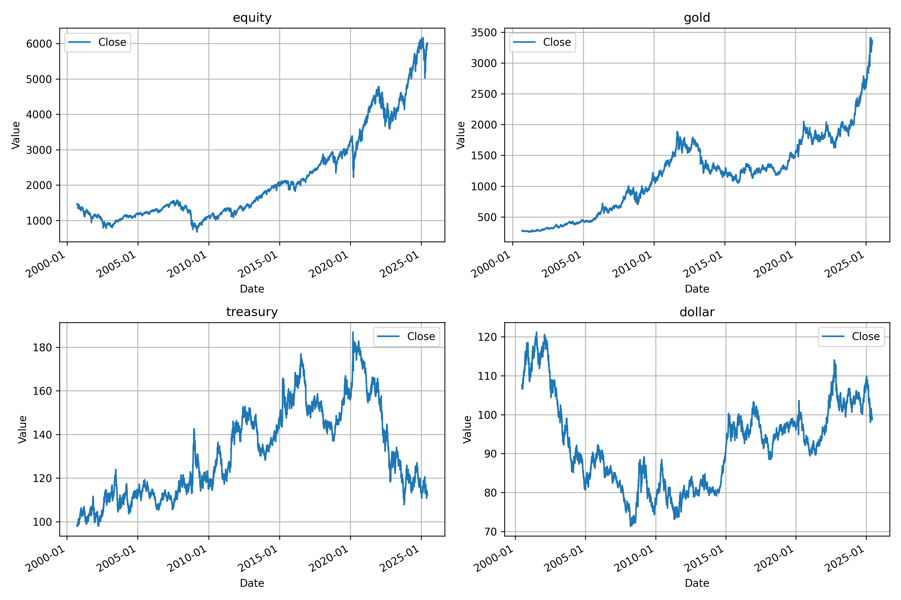

# 🧪 RL Test

## 📊 데이터 준비: Financial Data Downloader

이 프로젝트는 강화학습(RL) 실험에 필요한 주요 글로벌 금융 자산 데이터를 Yahoo Finance에서 다운로드하여 CSV 파일로 저장합니다.

### 📦 다운로드 대상 자산

- **S&P 500 E-mini 선물** (`ES=F`)
- **금 선물** (`GC=F`)
- **30년 만기 미국채 선물** (`ZB=F`)
- **달러 인덱스 선물** (`DX=F`)

---

## ⚙️ 실행 방법

```bash
# 필수 패키지 설치
pip install -r requirements.txt

# 로그 디렉토리 생성
mkdir -p data logs

# 데이터 다운로드 실행 및 로그 저장
python scripts/download_data.py --data_dir "./data" >> logs/download_data.log 2>&1

```

## 📈 결과 시각화


